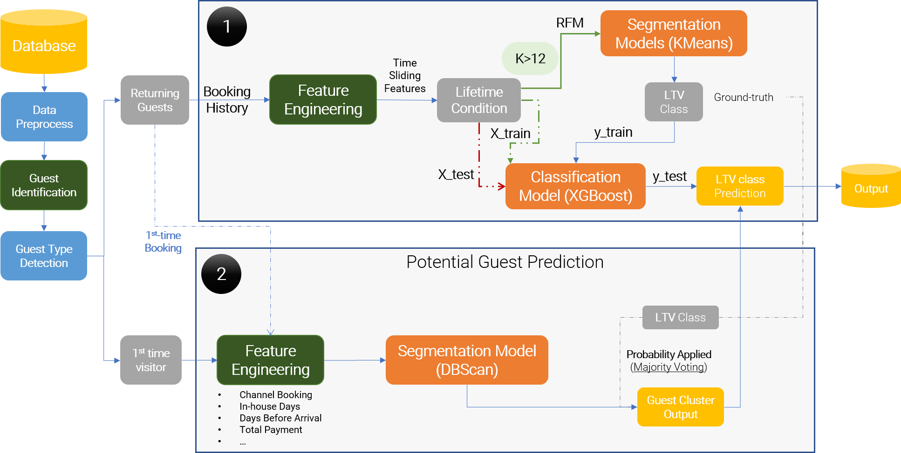

# Working Flow Explanation

## 1. Guest Identification
The first task in Guest Customer Lifetime Value model is to identify all possible guest profiles exist in the hospitality database.

Based on data that provided by Apaleo API, we propose using the [**Fuzzy Matcher**](https://github.com/RobinL/fuzzymatcher) method for guest identification task:
- Identification fields: First Name, Last Name, Email
- Threshold of [Levenshtein Distance](https://en.wikipedia.org/wiki/Levenshtein_distance): 0.15

## 2. Guest Type Detection
By checking number of bookings per guest, we build 2 datasets from original one: 
- **1st** reservations of **ALL** guests
- **ALL** reservations of **returning** guests

## 3. Feature Engineering
To solve [**CRM**](https://en.wikipedia.org/wiki/Customer_relationship_management) problem, we learn that  [Recency-Frequency-Monetary (**RFM**)](https://en.wikipedia.org/wiki/RFM_(market_research)) will be our key features. For fast implementation, we use [**featuretools**](https://github.com/alteryx/featuretools) to apply **aggregation** and **transformation** on raw features.

- With **returning guest**, we use **domain knowledge** to generate new features and then, apply [featuretools](https://github.com/alteryx/featuretools) for one-hot encoding **categorical** features
    - **Recency** features: InactiveDays, ...
    - **Frequency** features: NumberOfOrders, ...
    - **Monetary** features: TotalRevenue, ...
    - **Non-RFM** features: AverageNightsInHouse, NumberOfRooms, ...
- For **1st reservation**, our pipeline depends on [featuretools](https://github.com/alteryx/featuretools) to build new features and then, automatically remove noisy and correlated features.

## 4. Modeling
### 4.1. Customer Lifetime Value [CLV] 
#### 4.1.1. Segmentation
We filter customers whose lifetime is more than **k=12** months for this model; the others whose lifetime is less than 12 months will be classified by next model. For simplicity and speed, we choose **k-means clustering** as base model.
- <ins>Step 1</ins>: perform clustering on each **RFM features** (with adaptive **k** ranging from 2 to 9)
- <ins>Step 2</ins>: calculate **RFM score** by weighted aggregation from 3 models above
- <ins>Step 3</ins>: perform clustering on **RFM score** (with fixed **k=3** as Low, Middle, High classes of CLV)

The result is **CLV classes** of so-called **long-term** customers, this result will be used as **label** for next models.

#### 4.1.2.    Classification
For the **short-term** customers (who have spent less than 12 months as customer), we remove **RFM features** and train [**XGBoost**](https://xgboost.readthedocs.io/en/latest/get_started.html) with labels from the above model.

 **Noted:** If the database does not have any guest over 12 months lifetime, the model will automatically pick top 50% lifetime for training the CLV classification model

### 4.3. Potential VIP Guest Prediction
The First-Time Guest does not have the RFM information which means they can not be predicted by the LTV classification model. So we propose the method for calculating the probability LTV Classes of First-Time Guest based on the correlation between the 1st reservation of Returing Guest (which has LTV classes) and First-Time Guest.

Our approach is Density-based spatial clustering of applications with noise ([**DBSCAN**](https://en.wikipedia.org/wiki/DBSCAN)) clustering algorithm for its efficent in density information retrieval, noise removal and good performance.
